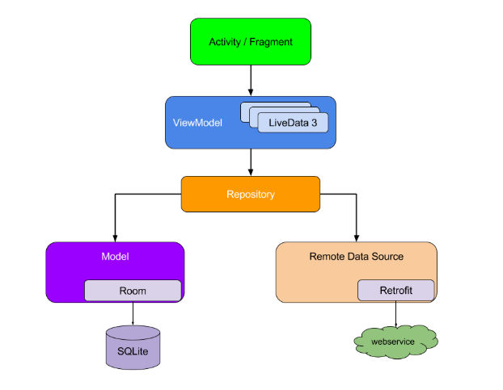
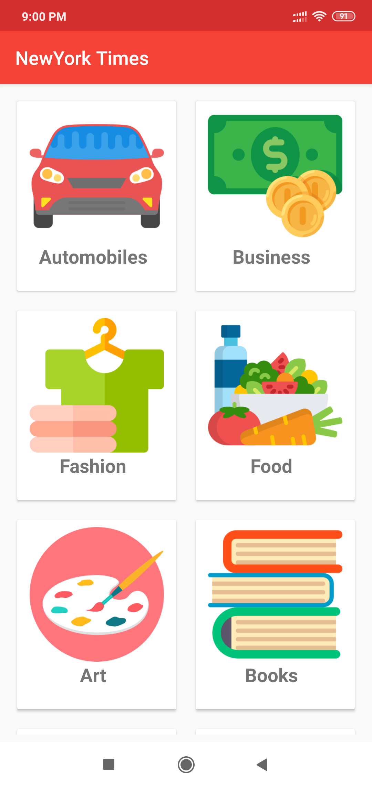
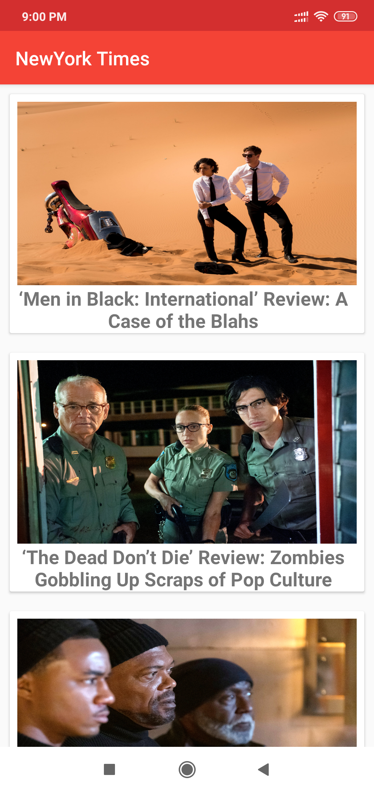
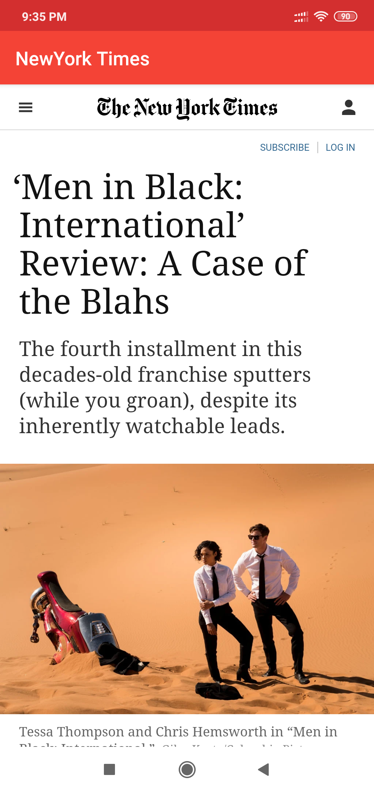

# NYTimesApp

This project is a simple example of MVVM pattern using ViewModel, Livedata, Room, Retrofit, RxJava and Picasso. 

The example uses NYTimes(New York Times) API. This app fetches top stories from the API and stores the response in the database. 
If network connectivity is not available then the same cached data which is stored in the database is shown to the user. 
If the network connectivity is available then the latest data is fetched from the database and shown to the user.

This app works in both Landscape and portrait mode.

Below is the architecture diagram(Image references::https://developer.android.com/jetpack/docs/guide)

Below are the screenshots of the image
1) MainPage screenshot showing different category news that user can see-

2) News List Page where user can scroll through the news to read news from particular category-

3) When you click on one of the news from the list you can read the news page will open in the webview-

